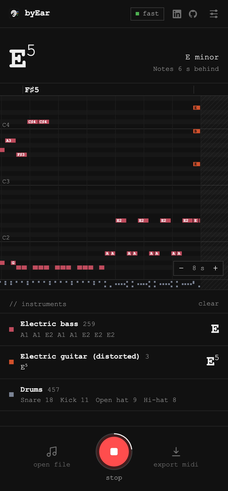

# byEar – Chord Finder & Audio to MIDI

**Hear a song, see its chords.** byEar is a Chrome extension that listens to whatever is playing in a tab (YouTube, Spotify, SoundCloud, a lesson video) and shows you, live, what every instrument is playing: the chords, the notes and the key. When the song ends, play back the original or the MIDI version, and export it as a `.mid` file for your DAW.

<p align="center">
  
</p>

- **Chords for every instrument.** Guitar, piano, bass, voice, strings, brass, drums: each gets its own channel strip with its chords or notes, and mute and solo buttons like a mixer.
- **Live, in a side panel.** Keep watching the video. byEar writes along a few seconds behind, then re-listens to the whole recording when you stop, for a cleaner result.
- **Vocals.** Switch on **vocals** for songs with singing and byEar follows the vocal line too.
- **Learn songs by ear, faster.** Solo a part, zoom into the piano roll, click to jump, switch between the original and the MIDI.
- **Tablature.** Switch the canvas from **midi** to **tab** for guitar and bass tabs (7-string guitar and 5-string bass when the part goes that low), fingered the way a player would.
- **Export MIDI.** One click, one track per instrument.
- **Private.** Everything runs on your own GPU. No audio is uploaded anywhere, and there's no account.
- **18 languages,** with note names the way musicians say them: C D E, Do Ré Mi, or C D E … H.

## Install

1. Download or clone this repository.
2. Open `chrome://extensions`, turn on **Developer mode** and click **Load unpacked**. Choose the folder.
3. Pin byEar, open a tab with music and click the byEar icon.
4. The first time, byEar downloads its model (about 200 MB, once). Then press **listen**.

Requires Chrome 116 or newer with WebGPU (any recent Mac, Windows or ChromeOS laptop).

## Tips

- Notes appear about 5 seconds after you hear them, because byEar listens in 5-second slices.
- Songs with singing: switch on **vocals** (under the key). Leave it off for instrumentals.
- Quiet audio is levelled automatically, but keeping the player's volume at 100% still helps.
- **Space** plays and stops. Over the piano roll: scroll for pitch, Shift + scroll for time, Ctrl/⌘ + scroll to zoom.
- In **settings** you can switch to the **accurate** model, which catches more, especially vocals in a busy mix. It needs a stronger GPU.
- Tell byEar which instruments to listen for (settings → only listen for certain instruments) when you know the line-up.
- **M** mutes a part, **S** solos it (several at once is fine). The big chord then follows what you hear.

## For developers

Plain JavaScript ES modules, no build step to run it. `node tools/build.mjs` checks the translations and packages `dist/byear-<version>.zip` for the Chrome Web Store.

| Part | Where |
|---|---|
| Side panel, tab capture, recording, review | `sidepanel.*`, `capture-worklet.js`, `ui/` |
| Transcription engine: hand-written WebGPU transformer with an fp16 KV cache and split-K attention, about 350 tokens/s on an Apple M-series GPU | `engine/` |
| Chords, key, note names, MIDI | `music/` |
| Translations (English is the master) | `ui/locales/`, generated `_locales/` |

Tests compare the engine to the reference implementation token for token:

```bash
node tests/decoder.test.mjs tests/fixtures/small.json
node tests/music.test.mjs
python3 -m http.server 8765 & node tests/run-in-chrome.mjs "http://127.0.0.1:8765/tests/gpu-test.html?f16=1"
```

`tests/fixtures/` (not in git) needs the model weights and a reference clip.

## Credits and license

Made by [jenyadoesapps](https://jenyadoesapps.com/). Privacy: byEar collects no data, see [PRIVACY.md](PRIVACY.md).

Transcription uses the open MuScriptor model by Kyutai and Mirelo ([paper](https://arxiv.org/abs/2607.08168)), whose weights are licensed [CC BY-NC 4.0](https://creativecommons.org/licenses/by-nc/4.0/): personal and research use only, not commercial. Only transcribe music you have the rights to.
